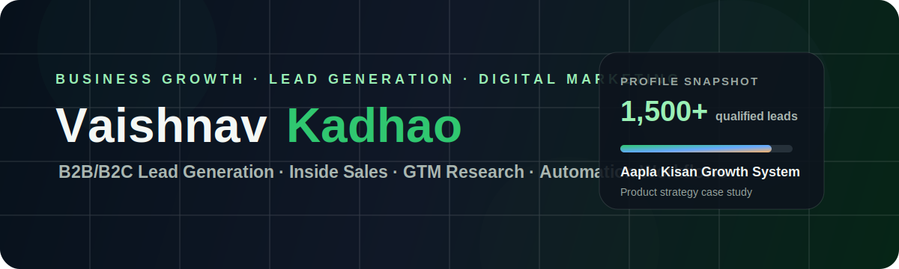

<div align="center">



<br />
<br />

# Vaishnav Kadhao

### Business Development · B2B Lead Generation · Digital Marketing · Automation Workflows

I work across **inside sales, B2B/B2C lead generation, digital marketing, GTM research, CRM workflows, and AI-assisted business operations**.

[](https://vaishnavkadhao.github.io/)
[](https://www.linkedin.com/in/vaishnav-kadhao)
[](mailto:vaishnav.kadhao1@gmail.com)
[](https://github.com/vaishnavkadhao)

</div>

---

## About

I am a Business Development and Digital Marketing professional with experience across **B2B/B2C lead generation, global SaaS prospecting, consultative sales, demand generation, campaign coordination, market research, and automation workflow planning**.

My work connects the front-end of growth — outreach, ICP mapping, appointment generation, stakeholder communication, and demand generation — with the execution layer of CRM hygiene, SOP planning, process mapping, dashboards, and business validation.

---

## Snapshot

| Area | Details |
|---|---|
| **Current Focus** | Digital growth, business development, lead generation, marketing automation, AI-assisted workflows |
| **Core Strength** | Turning research + outreach + process design into measurable pipeline |
| **Market Exposure** | USA-focused B2B/B2C campaigns, SaaS, technology, digital marketing, enterprise services |
| **Portfolio Direction** | Product strategy, business analysis, GTM planning, SOP documentation, operations workflows |

---

## Key Metrics

```text
5+   Years combined professional / entrepreneurial experience
1,500+ Qualified leads supported through campaign execution
3-6  Campaigns managed simultaneously
3+   Discovery appointments generated weekly
200+ Customers managed through Wild Gems Expeditions
```

---

## Featured Projects

| Project | Focus | Link |
|---|---|---|
| **Aapla Kisan Growth System** | Product strategy, fresh supply chain model, UI/UX, SOPs, MVP, stakeholder journeys, procurement and pricing | [View Repo](https://github.com/vaishnavkadhao/aapla-kisan-growth-system) |
| **LeadFlow** | B2B SaaS lead generation OS, ICP builder, lead database, cold email sequences, LinkedIn outreach, CRM-style pipeline, analytics | [View Repo](https://github.com/vaishnavkadhao/leadflow) |
| **AI-Assisted Marketing Workflow Blueprint** | AI research, lead routing, chatbot planning, follow-up workflows, automation planning | Planned |

---

## Project Preview: Aapla Kisan Growth System


Aapla Kisan is a proof-of-work case study for a fresh produce platform connecting **farmers, vendors, collection points, dark stores, consumers, and B2B buyers**.

| Document Layer | Status |
|---|---|
| Design System & UI/UX Guidelines | Complete |
| Business Model | Complete |
| Pilot Execution Plan | Complete |
| MVP Feature List | Complete |
| Procurement & Pricing Model | Complete |
| SOP & Operations Design | Complete |
| Stakeholder Journey Maps | Complete |

---

## Project Preview: LeadFlow


LeadFlow is a proof-of-work B2B SaaS project for managing the lead generation workflow from **ICP setup, lead database management, cold email sequences, LinkedIn outreach, CRM-style pipeline tracking, and analytics dashboards**.

| Module | Purpose |
|---|---|
| ICP & Persona Builder | Define targeting logic before outreach |
| Lead Database | Manage leads, notes, tasks, filters, imports, and exports |
| Cold Email Sequences | Structure multi-step outbound campaigns |
| LinkedIn Outreach | Plan touchpoints and save outreach templates |
| Pipeline Kanban | Move qualified leads through CRM-style stages |
| Analytics Dashboard | Track funnel, source mix, activities, and campaign KPIs |

---

## Skills & Tools

| Category | Skills / Tools |
|---|---|
| **Business Development** | Inside Sales, Consultative Sales, Lead Qualification, Appointment Generation, Stakeholder Communication |
| **Lead Generation** | B2B Lead Gen, B2C Outreach, USA Market Outreach, LinkedIn Sales Navigator, Apollo, Email Outreach, ICP Research |
| **Demand Generation** | ABM, MQL, SQL, BANT/HQL, Email Marketing, Webinar/Event Registration, Content Syndication |
| **Digital Marketing** | Google Ads Learning, Programmatic Marketing, Campaign Planning, GTM Research, Funnel Thinking |
| **CRM & Data** | Zoho CRM, Excel, Google Sheets, Database Research, Market Mapping, Data Hygiene |
| **AI & Automation** | ChatGPT, Gemini, Claude, Perplexity, Prompt Engineering, Zapier Basics, n8n Basics, Workflow Planning |
| **Documentation** | BRD-style planning, SOPs, case studies, process maps, project documentation |

---

## Experience Highlights

### Xin Global Services Pvt. Ltd. — Inside Sales Executive

- Worked on USA-focused B2B and B2C lead generation campaigns across SaaS, technology, digital marketing, media, enterprise services, and consumer-focused requirements.
- Supported global client acquisition through account research, decision-maker mapping, ICP-fit prospecting, lead qualification, and outreach-ready database preparation.
- Used LinkedIn Sales Navigator, Apollo, LinkedIn outreach, email outreach, database research, market mapping, and Zoho CRM.
- Contributed to **1,500+ qualified leads**, managed **3–6 campaigns simultaneously**, and generated around **3 discovery appointments weekly**.

### Aapla Kisan — Business Consultant / Portfolio Case Study

- Created a business blueprint for a fresh and quick commerce concept combining B2C urban demand with a B2B/D2H-style backend supply structure.
- Structured business model, operations flow, customer journey, producer onboarding, agent workflow, digital GTM approach, automation logic, and backend supply planning.
- Conducted stakeholder and market research around customer demand, pricing sensitivity, trust barriers, supply readiness, packaging gaps, and digital adoption.

### Wild Gems Expeditions — Founder & Planner

- Built and branded a niche wildlife travel and expedition service.
- Managed customer acquisition, service positioning, client communication, vendor coordination, pricing, budgeting, itinerary planning, and on-ground execution.
- Acquired and managed **200+ customers** through referrals, direct communication, social presence, and trust-led relationship building.

---

## GitHub Activity

<div align="center">


<br />
<br />


</div>

---

## Education & Certifications

| Area | Details |
|---|---|
| **M.Sc. Environmental Science** | Research, environmental systems, field insights, documentation, stakeholder understanding |
| **B.Sc. Environmental Science** | Research foundation, conservation, analysis, environmental thinking |
| **Digital Marketing & Programmatic Marketing** | LIPS India |
| **Google Ads Certification Program** | In progress |
| **Introduction to ESG** | Corporate Finance Institute |
| **Salesforce Agentforce / AI Agent Learning Module** | Completed |

---

<div align="center">

### Open to opportunities across Digital Marketing, B2B Lead Generation, Inside Sales, Marketing Automation, CRM Workflows, and Business Operations.

**Portfolio:** [vaishnavkadhao.github.io](https://vaishnavkadhao.github.io/)  
**LinkedIn:** [linkedin.com/in/vaishnav-kadhao](https://www.linkedin.com/in/vaishnav-kadhao)  
**Email:** [vaishnav.kadhao1@gmail.com](mailto:vaishnav.kadhao1@gmail.com)

</div>
