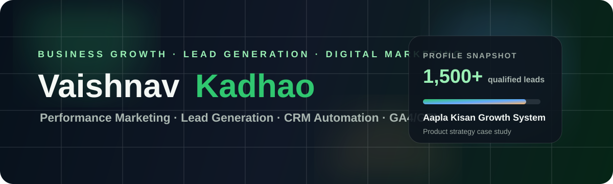

# Hey, I'm Vaishnav Kadhao 👋

**Business Development & Marketing Automation | CRM, Lead Generation, AI Workflows**

---

## 👤 About

I build tools and dashboards that help B2B teams generate, qualify, and convert leads faster. My background spans inside sales, CRM operations, and digital marketing — and I'm now combining that domain knowledge with Python, ML, and full-stack development to automate the parts of the sales funnel that most teams still do manually.
---

## 🚀 Featured Projects

<table>
<tr>
<td width="50%" valign="top">

### 🤖 AI Lead Scoring & Conversion Intelligence
*Logistic regression on 9,240 real leads. Predicts Hot/Warm/Cold, explains why, recommends next action.*

`Python` `scikit-learn` `Streamlit` `Plotly`

[→ Repo](https://github.com/vaishnavkadhao/ai-lead-scoring-conversion-intelligence) · [🚀 Live Demo](https://ai-lead-scoring-conversion-intelligence-6hbdet9neqq3q84jtayql6.streamlit.app)

</td>
<td width="50%" valign="top">

### ⚛️ LeadFlow — Full-Stack B2B SaaS
*ICP builder, lead database, outreach sequences, BANT/MEDDIC scoring, drag-and-drop Kanban, analytics.*

`React` `TypeScript` `Supabase` `Tailwind`

[→ Repo](https://github.com/vaishnavkadhao/leadflow) · [🚀 Live Demo](https://leadflow.vaishnavkadhao.workers.dev)

</td>
</tr>
<tr>
<td width="50%" valign="top">

### 📡 GTM + GA4 Measurement Dashboard
*UTM governance, GA4 event taxonomy, GTM trigger mapping, conversion-tracking QA.*

`Python` `Streamlit` `Plotly` `GTM` `GA4`

[→ Repo](https://github.com/vaishnavkadhao/gtm-ga4-measurement-dashboard-system) · [🚀 Live Demo](https://gtm-ga4-measurement-dashboard-system-sqywsegpmhzcxzz23wcwwr.streamlit.app)

</td>
<td width="50%" valign="top">

### 📊 AI Campaign Health Intelligence
*Multi-source campaign analytics with health scoring, budget pacing, and optimization recommendations.*

`Python` `Streamlit` `Plotly` `GA4 Logic`

[→ Repo](https://github.com/vaishnavkadhao/ai-performance-marketing-automation-lab) · [🚀 Live Demo](https://ai-performance-marketing-automation-lab-zzvxdwladc8tnrfaytvtxy.streamlit.app)

</td>
</tr>
<tr>
<td colspan="2" valign="top">

### 🌱 Aapla Kisan Growth System *(Case Study)*
*Product strategy, pilot blueprint, and supply chain operating model for a farm-to-consumer platform. Self-initiated case study covering business model, SOPs, UI/UX, MVP planning, and stakeholder journeys.*

`Business Analysis` `Product Strategy` `SOPs` `UI/UX` `GTM`

[→ Repo](https://github.com/vaishnavkadhao/aapla-kisan-growth-system)

</td>
</tr>
</table>

---

## 🛠️ Tech Stack

<table>
<tr>
<td valign="top" width="50%">

**📈 Marketing & CRM**

-FF7A59?style=flat-square&logo=hubspot&logoColor=white)

**🧠 Data & ML**

</td>
<td valign="top" width="50%">

**⚛️ Frontend & Full-Stack**

**⚙️ Automation & Tools**
-6D00CC?style=flat-square&logo=make&logoColor=white)
-EA4B71?style=flat-square&logo=n8n&logoColor=white)

</td>
</tr>
</table>

---

## 💼 Experience

**🏢 Inside Sales & Lead Generation** · *Xin Global Solutions* · May 2024 — Jun 2025
- Managed B2B outbound prospecting using Apollo, LinkedIn Sales Navigator, and Zoho CRM
- Built lead lists, ran email sequences, qualified leads, and tracked pipeline
- Contributed to **1,500+ qualified leads** across **3-6 active campaigns**, ~3 discovery appointments weekly

**🌱 GTM & Growth Consulting** · *Aapla Kisan (Self-Initiated Case Study)* · Jun 2025 — Apr 2026
- Designed product strategy, pilot plan, procurement model, and SOPs for a fresh produce platform
- Produced 7-layer documentation: business model → stakeholder journey maps → MVP feature list

**🏔️ Founder** · *Wild Gems Expeditions* · Aug 2016 — Aug 2022
- Built and operated a wildlife travel business — marketing, operations, customer management
- Acquired and managed **200+ customers** through referrals and direct outreach

---

## 📊 GitHub Stats

---

## 🤝 Let's Connect

---

*"The best leads don't come from luck — they come from systems."*

⭐ If any of my projects spark an idea, drop me a message — always open to interesting conversations about sales ops, growth, and automation.

